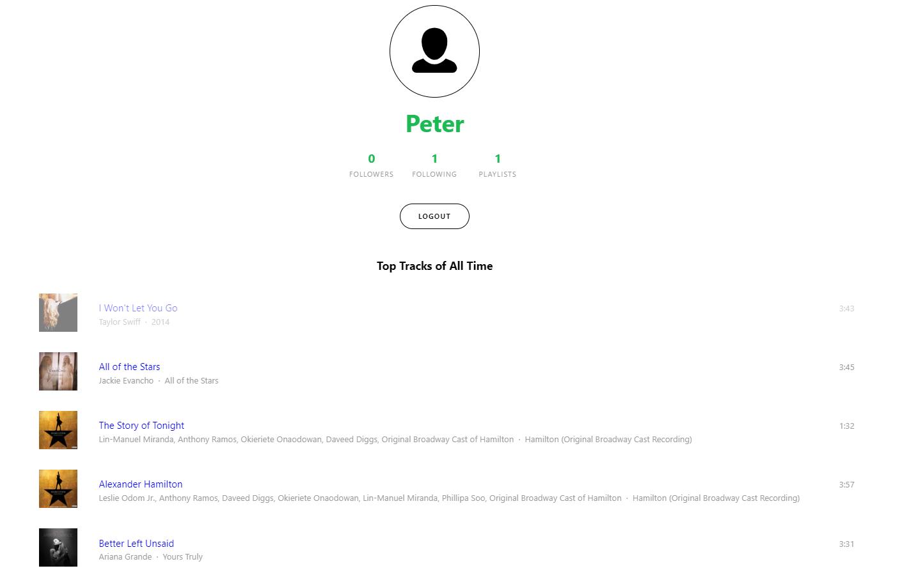
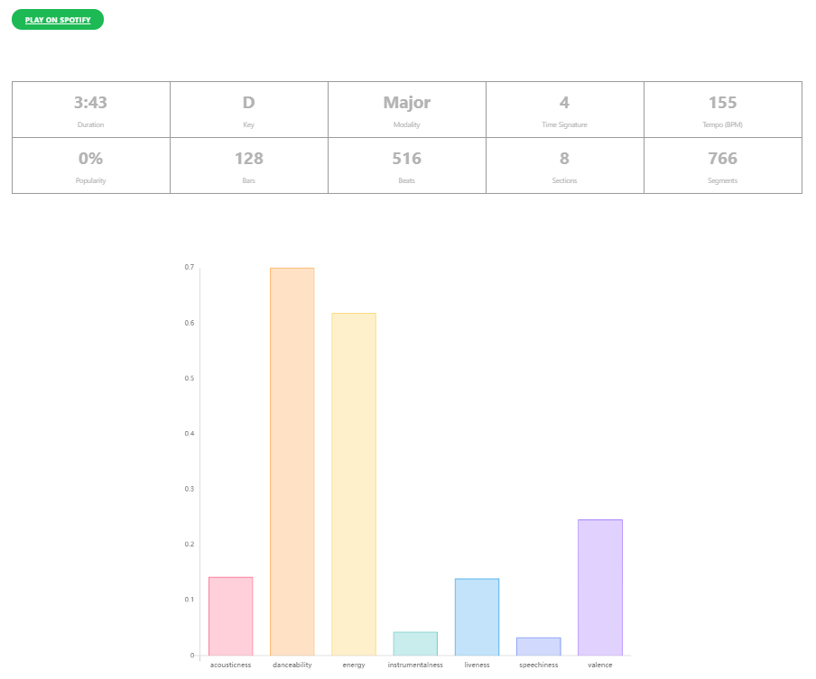

# Spotify Analytics
## Features
- Displays a user's profile, number of followers and following, playlists, and top tracks of all time

- Shows a song's duration, key, modality, time signature, tempo, popularity, number of bars, beats, sections, and segments

- Analyzes about a song's acousticness, danceability, energy, instrumentalness, liveness, speechiness, and valence

## Purpose
As a musician, I spend a lot of time listening to music on Spotify. I have frequently wanted to analyze and compare the statistics of my top songs, which is why I created this app.

## Demo
[Demo link](https://www.youtube.com/watch?v=OSURBmSPYDU&feature=youtu.be)

## Screenshots
#### Homescreen

#### Analytics

## Terminologies Explained
### Song Analysis
**Duration**: The duration (in seconds) of the time interval.

**Key**: The estimated overall key of the section. The values in this field ranging from 0 to 11 mapping to pitches using standard Pitch Class notation (E.g. 0 = C, 1 = C♯/D♭, 2 = D, and so on). If no key was detected, the value is -1.

**Mode**: 	Indicates the modality (major or minor) of a track, the type of scale from which its melodic content is derived. This field will contain a 0 for “minor”, a 1 for “major”, or a -1 for no result. *Note that the major key (e.g. C major) could more likely be confused with the minor key at 3 semitones lower (e.g. A minor) as both keys carry the same pitches.*

**Time Signature**: An estimated overall time signature of a track. The time signature (meter) is a notational convention to specify how many beats are in each bar (or measure). The time signature ranges from 3 to 7 indicating time signatures of “3/4”, to “7/4”.

**Tempo**: The overall estimated tempo of a track in beats per minute (BPM). In musical terminology, tempo is the speed or pace of a given piece and derives directly from the average beat duration.

**Popularity**: The popularity of the track. The value will be between 0 and 100, with 100 being the most popular.
The popularity of a track is a value between 0 and 100, with 100 being the most popular. The popularity is calculated by algorithm and is based, in the most part, on the total number of plays the track has had and how recent those plays are.

Generally speaking, songs that are being played a lot now will have a higher popularity than songs that were played a lot in the past. Duplicate tracks (e.g. the same track from a single and an album) are rated independently. Artist and album popularity is derived mathematically from track popularity. Note that the popularity value may lag actual popularity by a few days: the value is not updated in real time.

**Bars**: The time intervals of the bars throughout the track. A bar (or measure) is a segment of time defined as a given number of beats. Bar offsets also indicate downbeats, the first beat of the measure.

**Beats**: The time intervals of beats throughout the track. A beat is the basic time unit of a piece of music; for example, each tick of a metronome. Beats are typically multiples of tatums.

**Sections**: Sections are defined by large variations in rhythm or timbre, e.g. chorus, verse, bridge, guitar solo, etc. Each section contains its own descriptions of tempo, key, mode, time_signature, and loudness.

**Segments**: Audio segments attempts to subdivide a song into many segments, with each segment containing a roughly consistent sound throughout its duration.

**For more information about audio analysis, please visit this [link](https://developer.spotify.com/documentation/web-api/reference/tracks/get-audio-analysis/).**

### Song Features
**Acousticness**: A confidence measure from 0.0 to 1.0 of whether the track is acoustic. 1.0 represents high confidence the track is acoustic. 

**Danceability**: Danceability describes how suitable a track is for dancing based on a combination of musical elements including tempo, rhythm stability, beat strength, and overall regularity. A value of 0.0 is least danceable and 1.0 is most danceable. 

**Energy**: Energy is a measure from 0.0 to 1.0 and represents a perceptual measure of intensity and activity. Typically, energetic tracks feel fast, loud, and noisy. For example, death metal has high energy, while a Bach prelude scores low on the scale. Perceptual features contributing to this attribute include dynamic range, perceived loudness, timbre, onset rate, and general entropy. 

**Instrumentalness**: Predicts whether a track contains no vocals. “Ooh” and “aah” sounds are treated as instrumental in this context. Rap or spoken word tracks are clearly “vocal”. The closer the instrumentalness value is to 1.0, the greater likelihood the track contains no vocal content. Values above 0.5 are intended to represent instrumental tracks, but confidence is higher as the value approaches 1.0.

**Liveness**: Detects the presence of an audience in the recording. Higher liveness values represent an increased probability that the track was performed live. A value above 0.8 provides strong likelihood that the track is live. 

**Speechiness**: Detects the presence of spoken words in a track. The more exclusively speech-like the recording (e.g. talk show, audio book, poetry), the closer to 1.0 the attribute value. Values above 0.66 describe tracks that are probably made entirely of spoken words. Values between 0.33 and 0.66 describe tracks that may contain both music and speech, either in sections or layered, including such cases as rap music. Values below 0.33 most likely represent music and other non-speech-like tracks. 

**Valence**: A measure from 0.0 to 1.0 describing the musical positiveness conveyed by a track. Tracks with high valence sound more positive (e.g. happy, cheerful, euphoric), while tracks with low valence sound more negative (e.g. sad, depressed, angry).

**For more information about audio features, please visit this [link](https://developer.spotify.com/documentation/web-api/reference/tracks/get-audio-features/).**
